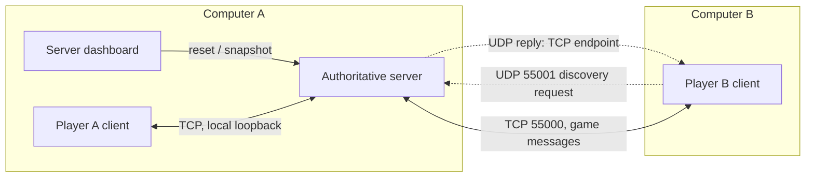

# Project structure and operation

```text
dup-me-rubric/
├── play.py / client.py          Player launcher and CLI options
├── server.py                   Optional separate server/dashboard
├── ai_bot.py                   Optional standalone bot launcher
├── check_connection.py         TCP app/version diagnostic
├── self_test.py                Portable automated test runner
├── src/
│   ├── common/
│   │   ├── config.py           Ports, version, rules, notes, instruments
│   │   ├── protocol.py         Length-prefixed JSON over TCP
│   │   ├── message_types.py    Message names
│   │   ├── validation.py       Nicknames and note validation
│   │   ├── networking.py       Address checks, IP candidates, TCP probe
│   │   └── discovery.py        UDP discovery + connection JSON files
│   ├── server/
│   │   ├── server.py           Authoritative server and timer controller
│   │   ├── game_engine.py      Role assignment, scoring, state transitions
│   │   ├── client_session.py   Per-connection receive/send workers
│   │   ├── player_manager.py   Registered/public player records
│   │   └── server_ui.py        Count/list, scores, log, reset, export endpoint
│   ├── client/
│   │   ├── client_ui.py        Screens, inputs, dialogs and event handling
│   │   ├── network_client.py   TCP handshake, send/receive, heartbeats
│   │   ├── local_game.py       Owns optional local server and bot
│   │   ├── pixel_ui.py         Board state, drawing, keys, responsive layout
│   │   ├── sound.py            Local waveform synthesis and playback
│   │   └── match_report.py     Post-match review and CSV export
│   └── bot/
│       ├── ai_bot.py           Networked opponent behavior
│       └── difficulty_model.py Explainable adaptive rules
├── tests/                      Unit, socket integration and optional GUI tests
└── docs/                       Protocol, rubric and professor/demo notes
```

## Network layout



The direct connection from A's client to its server still uses sockets even when **Host and play** keeps both in one process. The separate-program setup runs `server.py` and `play.py` as separate processes on A. B runs only `play.py`. Solo mode creates a loopback-only server with an OS-assigned port and starts both human and bot clients against it.

## From launch to match

1. A opens a listening TCP socket; public hosting also starts a UDP discovery responder.
2. B broadcasts a nonce-tagged discovery request, displays matching hosts and obtains the host address/port. A saved connection file is a fallback.
3. Each client opens TCP and sends its nickname and version. Server validates, assigns a player ID and sends welcome plus membership information.
4. With two registered players, server randomly picks the first creator and starts the 10-second deadline.
5. Accepted creation moves are broadcast to both players; GUI events display/play the note locally.
6. At the deadline, server switches to repetition. Clients clear the visible pattern. The repeater gets up to 20 seconds to answer; server compares positions and broadcasts scores.
7. Server reveals round results, waits two seconds, swaps roles, then runs the next round.
8. After the configured last round, results and rematch controls appear. Both votes start another match with the previous winner first.

## State and concurrency

Game states: `WAITING_FOR_PLAYERS` → `ROUND_1_CREATE` → `ROUND_1_REPEAT` → `ROUND_2_CREATE` → `ROUND_2_REPEAT` → `MATCH_RESULTS` → `WAITING_FOR_REMATCH`. Extended mode adds corresponding numbered phase states before results. Round result display uses a closed phase plus a scheduled transition.

The server owns deadlines, roles, patterns, scores and votes. An `RLock` protects state shared by the accept, controller and session threads. Each session has receive/send workers and a bounded outgoing queue. The controller checks deadlines about every 100 ms; it broadcasts integer countdown updates when the displayed value changes.

The client uses background connection, receive, send, heartbeat and discovery work. Queues deliver events to the Tk main thread. This avoids changing widgets from a network thread and prevents network delays from freezing user input.

## Fault handling and scope

The protocol caps each TCP message at 64 KiB and rejects malformed framing/JSON. The server checks version, nickname uniqueness, phase, turn token, role, note validity, capacity and deadline. Unregistered connections time out after 10 seconds. Heartbeats run every 3 seconds; stale registered connections expire after approximately 15 seconds without traffic. Reset/disconnect cancels current game state, and bot phase cancellation prevents queued old actions from leaking into a new turn.

The server supports one active two-player match and waiting clients, not multiple independent rooms. Storage is in memory, with user-triggered JSON/CSV exports. This is a plain-TCP LAN application without TLS, account authentication or NAT traversal. No external AI service is involved.
